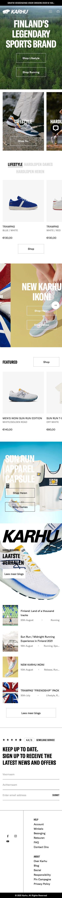
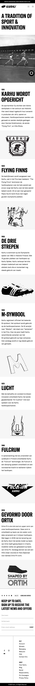

# Procesverslag
Markdown is een simpele manier om HTML te schrijven.  
Markdown cheat cheet: [Hulp bij het schrijven van Markdown](https://github.com/adam-p/markdown-here/wiki/Markdown-Cheatsheet).

Nb. De standaardstructuur en de spartaanse opmaak van de README.md zijn helemaal prima. Het gaat om de inhoud van je procesverslag. Besteedt de tijd voor pracht en praal aan je website.

Nb. Door *open* toe te voegen aan een *details* element kun je deze standaard open zetten. Fijn om dat steeds voor de relevante stuk(ken) te doen.

## Jij

uitwerken voor kick-off werkgroep

### Auteur:
Joppe Pronk

#### Je startniveau:
 blauw

#### Je focus:
surface plane
 

## Je website

uitwerken voor kick-off werkgroep

### Je opdracht:
https://nl.karhu.com/
 
#### Screenshot(s) van de eerste pagina (small screen): 
Homepagina

#### Screenshot(s) van de tweede pagina (small screen):
Over Karhu

 

## Breakdownschets (week 1)

uitwerken na afloop 2e werkgroep

### de hele pagina: 

### dynamisch deel (bijv menu): 

### wellicht nog een dynamisch deel (bijv filter): 

## Voortgang 1 (week 2)

uitwerken voor 1e voortgang

### Stand van zaken
Alle content en afbeeldingen zijn zo goed als erin gezet - heb nog moeite met hamburgere menu

### Agenda voor meeting
samen met je groepje opstellen

| Joppe.         | Maeren.            | Leo          | Timo                |
| ---            | ---                | ---          | ---                 |
| - Mijn HTML    | Responsiveness en  | Willekeurige-| html kan schrijven  |
| - Positioneren | positioneren.      | posities     | zonder div’s, id’s. |
|                | ...                | ...          | CSS positioneren    |

### Verslag van meeting
hier na afloop snel de uitkomsten van de meeting vastleggen

- punt 1: Tips voor hamburger menu: https://codepen.io/erikterwan/pen/EVzeRP
- punt 2: Kopjes boven de afbeeldingen

## Voortgang 2 (week 3)

uitwerken voor 2e voortgang

### Stand van zaken
Ik heb al een groot deel responsive gemaakt!

### Agenda voor meeting
samen met je groepje opstellen

| Joppe.         | Maeren             | Timo                     | Leo                                |
| ---            | ---                | ---                      | ---                                |
| Werken met     | nette html.        | Werken met media query's | Selectoren, wanner je met meerdere |
|-grid/ flexbox. | CSS positioneren.  | voor responsiveness      | paginas's werkt +                  |
| ...            | ...                | ...                      | media query's.                     |

### Verslag van meeting
hier na afloop snel de uitkomsten van de meeting vastleggen

- Tips voor een responsive menu
- Welke selectoren ik kan gebruiken, alleen div, class voor styling

## Toegankelijkheidstest (week 4)

uitwerken na test in 8e voortgang

### Bevindingen
Lijst met je bevindingen die in de test naar voren kwamen:
 
1) Muis en toetsenboard:
 
 - Met tab begint het bij een verkeerde button <--oplossing---> In de a een # plaatsen.
 - In menu is de active state niet zichtbaar <--oplossing---> :active in css.
 - Nog niet overal een hover state bij buttons <--oplossing---> Meer hover states implementeren.
 
2) Sreen readers:
 
 - Nog niet alle afbeeldinfgen hadden een naam gekregen <--oplossing---> bij img > alt specfieker zijn.
 
 
3) Diverse beperkingen
 
 - Buttons zijn redelijk klein  <--oplossing---> Buttons en de ruimte om de button vergroten.
 - Er zijn sommige tekstenslecht te lezen bijv. in de header  <--oplossing---> groter contrast in de kleuren gebruiken.
 
 
 

## Voortgang 3 (week 4)

uitwerken voor 3e voortgang

### Stand van zaken
Ik heb een beetje moeite met de footer maken, ik wil grid gebruiken, maar ik krijg heel veel witruimte tussen m'n teksten....

### Agenda voor meeting
samen met je groepje opstellen

|Joppe           | Timo.              | student 3    | student 4        |
| ---            | ---                | ---          | ---              |
| Grid +         | Media query's      | en ik dit    | en dan ik dat    |
| font-face      |                    | nog een punt | dit wil ik zeker |
| ...            | ...                | ...          | ...              |

### Verslag van meeting
hier na afloop snel de uitkomsten van de meeting vastleggen

- Ik kan het best eerst een tekening maken van het er met grid uit moet te komen zien, en daarna met grid aan de slag gaan
- Ik moet voor de verschillende fotns ook eigen font familys aanmaken... deze hoeven ook niet perse in de :root.
 

## Eindgesprek (week 5)

uitwerken voor eindgesprek

### Stand van zaken
Ik heb voor het eerst gewerkt met grids, dat ging in het begin moeizaam, maar na een tijdje begon het steeds beter te lukken.
Ik voorla ondervinden dan grids heel flexiebel zijn. 
 

 

 
 
Waar ik nog wel een beetje moeite mee had was het menu na te maken van de live website, dit is me ook deels niet gelukt (ook door de deadline) 

  

 

 
 
### Screenshot(s)

hier screenshot(s) van je eindresultaat

 

 
 

## Bronnenlijst

continu bijhouden terwijl je werkt

Nb. Wees specifiek ('css-tricks' als bron is bijv. niet specifiek genoeg).

1. Bijna alle oefeningen van codepen: https://codepen.io/your-work/
2. https://developer.mozilla.org/en-US/docs/Web/CSS/:active
3. https://css-tricks.com/snippets/css/a-guide-to-flexbox/
4. https://css-tricks.com/snippets/css/complete-guide-grid/

